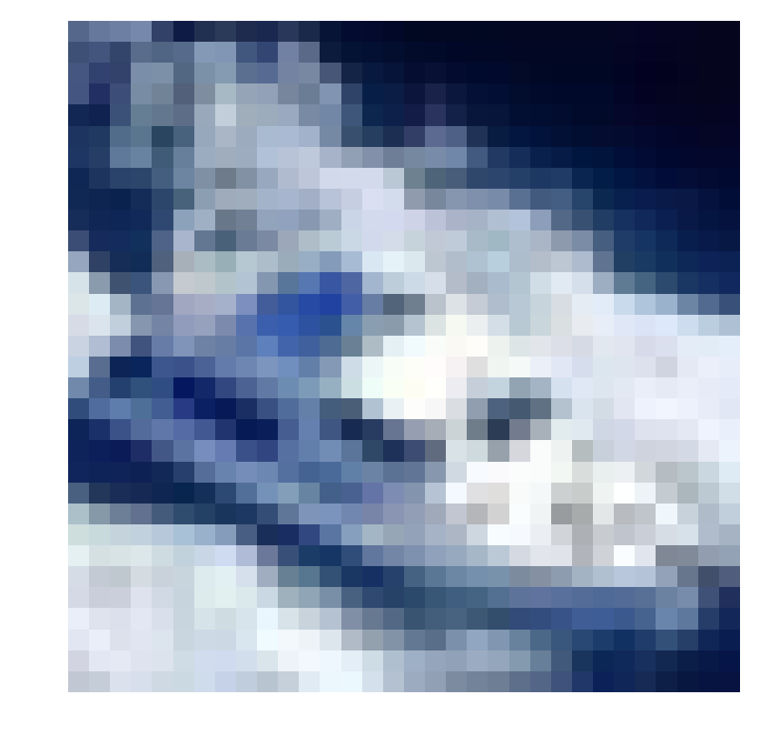
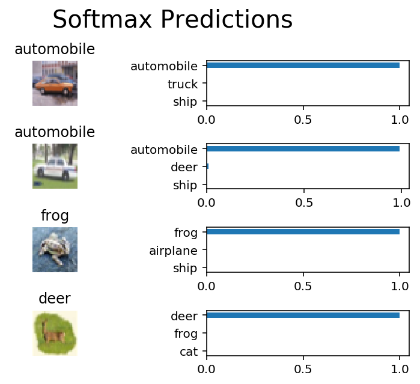

# Image Classification
In this project, you'll classify images from the [CIFAR-10 dataset](https://www.cs.toronto.edu/~kriz/cifar.html).  The dataset consists of airplanes, dogs, cats, and other objects. You'll preprocess the images, then train a convolutional neural network on all the samples. The images need to be normalized and the labels need to be one-hot encoded.  You'll get to apply what you learned and build a convolutional, max pooling, dropout, and fully connected layers.  At the end, you'll get to see your neural network's predictions on the sample images.
## Get the Data
Run the following cell to download the [CIFAR-10 dataset for python](https://www.cs.toronto.edu/~kriz/cifar-10-python.tar.gz).


```python
"""
DON'T MODIFY ANYTHING IN THIS CELL THAT IS BELOW THIS LINE
"""
from urllib.request import urlretrieve
from os.path import isfile, isdir
from tqdm import tqdm
import problem_unittests as tests
import tarfile

cifar10_dataset_folder_path = 'cifar-10-batches-py'

class DLProgress(tqdm):
    last_block = 0

    def hook(self, block_num=1, block_size=1, total_size=None):
        self.total = total_size
        self.update((block_num - self.last_block) * block_size)
        self.last_block = block_num

if not isfile('cifar-10-python.tar.gz'):
    with DLProgress(unit='B', unit_scale=True, miniters=1, desc='CIFAR-10 Dataset') as pbar:
        urlretrieve(
            'https://www.cs.toronto.edu/~kriz/cifar-10-python.tar.gz',
            'cifar-10-python.tar.gz',
            pbar.hook)

if not isdir(cifar10_dataset_folder_path):
    with tarfile.open('cifar-10-python.tar.gz') as tar:
        tar.extractall()
        tar.close()


tests.test_folder_path(cifar10_dataset_folder_path)
```

    CIFAR-10 Dataset: 171MB [00:33, 5.07MB/s]


    All files found!


## Explore the Data
The dataset is broken into batches to prevent your machine from running out of memory.  The CIFAR-10 dataset consists of 5 batches, named `data_batch_1`, `data_batch_2`, etc.. Each batch contains the labels and images that are one of the following:
* airplane
* automobile
* bird
* cat
* deer
* dog
* frog
* horse
* ship
* truck

Understanding a dataset is part of making predictions on the data.  Play around with the code cell below by changing the `batch_id` and `sample_id`. The `batch_id` is the id for a batch (1-5). The `sample_id` is the id for a image and label pair in the batch.

Ask yourself "What are all possible labels?", "What is the range of values for the image data?", "Are the labels in order or random?".  Answers to questions like these will help you preprocess the data and end up with better predictions.


```python
%matplotlib inline
%config InlineBackend.figure_format = 'retina'

import helper
import numpy as np

# Explore the dataset
batch_id = 2
sample_id = 4
helper.display_stats(cifar10_dataset_folder_path, batch_id, sample_id)
```


    Stats of batch 2:
    Samples: 10000
    Label Counts: {0: 984, 1: 1007, 2: 1010, 3: 995, 4: 1010, 5: 988, 6: 1008, 7: 1026, 8: 987, 9: 985}
    First 20 Labels: [1, 6, 6, 8, 8, 3, 4, 6, 0, 6, 0, 3, 6, 6, 5, 4, 8, 3, 2, 6]

    Example of Image 4:
    Image - Min Value: 0 Max Value: 255
    Image - Shape: (32, 32, 3)
    Label - Label Id: 8 Name: ship





## Implement Preprocess Functions
### Normalize
In the cell below, implement the `normalize` function to take in image data, `x`, and return it as a normalized Numpy array. The values should be in the range of 0 to 1, inclusive.  The return object should be the same shape as `x`.


```python
def normalize(x):
    """
    Normalize a list of sample image data in the range of 0 to 1
    : x: List of image data.  The image shape is (32, 32, 3)
    : return: Numpy array of normalize data
    """
    # TODO: Implement Function
    return x / 255 # x - np.min(x) / (np.max(x) - np.min(x))


"""
DON'T MODIFY ANYTHING IN THIS CELL THAT IS BELOW THIS LINE
"""
tests.test_normalize(normalize)
```

    Tests Passed


### One-hot encode
Just like the previous code cell, you'll be implementing a function for preprocessing.  This time, you'll implement the `one_hot_encode` function. The input, `x`, are a list of labels.  Implement the function to return the list of labels as One-Hot encoded Numpy array.  The possible values for labels are 0 to 9. The one-hot encoding function should return the same encoding for each value between each call to `one_hot_encode`.  Make sure to save the map of encodings outside the function.

Hint: Don't reinvent the wheel.


```python
def one_hot_encode(x):
    """
    One hot encode a list of sample labels. Return a one-hot encoded vector for each label.
    : x: List of sample Labels
    : return: Numpy array of one-hot encoded labels
    """
    # TODO: Implement Function
    z = np.zeros((len(x), 10))
    z[list(np.indices((len(x),))) + [x]] = 1
    return z


"""
DON'T MODIFY ANYTHING IN THIS CELL THAT IS BELOW THIS LINE
"""
tests.test_one_hot_encode(one_hot_encode)
```

    Tests Passed


### Randomize Data
As you saw from exploring the data above, the order of the samples are randomized.  It doesn't hurt to randomize it again, but you don't need to for this dataset.

## Preprocess all the data and save it
Running the code cell below will preprocess all the CIFAR-10 data and save it to file. The code below also uses 10% of the training data for validation.


```python
"""
DON'T MODIFY ANYTHING IN THIS CELL
"""
# Preprocess Training, Validation, and Testing Data
helper.preprocess_and_save_data(cifar10_dataset_folder_path, normalize, one_hot_encode)
```

# Check Point
This is your first checkpoint.  If you ever decide to come back to this notebook or have to restart the notebook, you can start from here.  The preprocessed data has been saved to disk.


```python
"""
DON'T MODIFY ANYTHING IN THIS CELL
"""
import pickle
import problem_unittests as tests
import helper

# Load the Preprocessed Validation data
valid_features, valid_labels = pickle.load(open('preprocess_validation.p', mode='rb'))
```

## Build the network
For the neural network, you'll build each layer into a function.  Most of the code you've seen has been outside of functions. To test your code more thoroughly, we require that you put each layer in a function.  This allows us to give you better feedback and test for simple mistakes using our unittests before you submit your project.

>**Note:** If you're finding it hard to dedicate enough time for this course each week, we've provided a small shortcut to this part of the project. In the next couple of problems, you'll have the option to use classes from the [TensorFlow Layers](https://www.tensorflow.org/api_docs/python/tf/layers) or [TensorFlow Layers (contrib)](https://www.tensorflow.org/api_guides/python/contrib.layers) packages to build each layer, except the layers you build in the "Convolutional and Max Pooling Layer" section.  TF Layers is similar to Keras's and TFLearn's abstraction to layers, so it's easy to pickup.

>However, if you would like to get the most out of this course, try to solve all the problems _without_ using anything from the TF Layers packages. You **can** still use classes from other packages that happen to have the same name as ones you find in TF Layers! For example, instead of using the TF Layers version of the `conv2d` class, [tf.layers.conv2d](https://www.tensorflow.org/api_docs/python/tf/layers/conv2d), you would want to use the TF Neural Network version of `conv2d`, [tf.nn.conv2d](https://www.tensorflow.org/api_docs/python/tf/nn/conv2d).

Let's begin!

### Input
The neural network needs to read the image data, one-hot encoded labels, and dropout keep probability. Implement the following functions
* Implement `neural_net_image_input`
 * Return a [TF Placeholder](https://www.tensorflow.org/api_docs/python/tf/placeholder)
 * Set the shape using `image_shape` with batch size set to `None`.
 * Name the TensorFlow placeholder "x" using the TensorFlow `name` parameter in the [TF Placeholder](https://www.tensorflow.org/api_docs/python/tf/placeholder).
* Implement `neural_net_label_input`
 * Return a [TF Placeholder](https://www.tensorflow.org/api_docs/python/tf/placeholder)
 * Set the shape using `n_classes` with batch size set to `None`.
 * Name the TensorFlow placeholder "y" using the TensorFlow `name` parameter in the [TF Placeholder](https://www.tensorflow.org/api_docs/python/tf/placeholder).
* Implement `neural_net_keep_prob_input`
 * Return a [TF Placeholder](https://www.tensorflow.org/api_docs/python/tf/placeholder) for dropout keep probability.
 * Name the TensorFlow placeholder "keep_prob" using the TensorFlow `name` parameter in the [TF Placeholder](https://www.tensorflow.org/api_docs/python/tf/placeholder).

These names will be used at the end of the project to load your saved model.

Note: `None` for shapes in TensorFlow allow for a dynamic size.


```python
import tensorflow as tf

def neural_net_image_input(image_shape):
    """
    Return a Tensor for a batch of image input
    : image_shape: Shape of the images
    : return: Tensor for image input.
    """
    # TODO: Implement Function
    return tf.placeholder(tf.float32, shape=(None,)+image_shape, name='x')


def neural_net_label_input(n_classes):
    """
    Return a Tensor for a batch of label input
    : n_classes: Number of classes
    : return: Tensor for label input.
    """
    # TODO: Implement Function
    return tf.placeholder(tf.float32, shape=(None, n_classes), name='y')


def neural_net_keep_prob_input():
    """
    Return a Tensor for keep probability
    : return: Tensor for keep probability.
    """
    # TODO: Implement Function
    return tf.placeholder(tf.float32, name='keep_prob')


"""
DON'T MODIFY ANYTHING IN THIS CELL THAT IS BELOW THIS LINE
"""
tf.reset_default_graph()
tests.test_nn_image_inputs(neural_net_image_input)
tests.test_nn_label_inputs(neural_net_label_input)
tests.test_nn_keep_prob_inputs(neural_net_keep_prob_input)
```

    Image Input Tests Passed.
    Label Input Tests Passed.
    Keep Prob Tests Passed.


### Convolution and Max Pooling Layer
Convolution layers have a lot of success with images. For this code cell, you should implement the function `conv2d_maxpool` to apply convolution then max pooling:
* Create the weight and bias using `conv_ksize`, `conv_num_outputs` and the shape of `x_tensor`.
* Apply a convolution to `x_tensor` using weight and `conv_strides`.
 * We recommend you use same padding, but you're welcome to use any padding.
* Add bias
* Add a nonlinear activation to the convolution.
* Apply Max Pooling using `pool_ksize` and `pool_strides`.
 * We recommend you use same padding, but you're welcome to use any padding.

**Note:** You **can't** use [TensorFlow Layers](https://www.tensorflow.org/api_docs/python/tf/layers) or [TensorFlow Layers (contrib)](https://www.tensorflow.org/api_guides/python/contrib.layers) for **this** layer, but you can still use TensorFlow's [Neural Network](https://www.tensorflow.org/api_docs/python/tf/nn) package. You may still use the shortcut option for all the **other** layers.


```python
def conv2d_maxpool(x_tensor, conv_num_outputs, conv_ksize, conv_strides, pool_ksize, pool_strides):
    """
    Apply convolution then max pooling to x_tensor
    :param x_tensor: TensorFlow Tensor
    :param conv_num_outputs: Number of outputs for the convolutional layer
    :param conv_ksize: kernal size 2-D Tuple for the convolutional layer
    :param conv_strides: Stride 2-D Tuple for convolution
    :param pool_ksize: kernal size 2-D Tuple for pool
    :param pool_strides: Stride 2-D Tuple for pool
    : return: A tensor that represents convolution and max pooling of x_tensor
    """
    # TODO: Implement Function

    # Weight and bias
    weight = tf.Variable(tf.truncated_normal([*conv_ksize, x_tensor.shape.as_list()[3], conv_num_outputs],stddev=5e-2))
    bias = tf.Variable(tf.zeros(conv_num_outputs))

    # Apply Convolution
    conv_layer = tf.nn.conv2d(x_tensor,
                              weight,
                              strides=[1, *conv_strides, 1],
                              padding='SAME')
    # Add bias
    conv_layer = tf.nn.bias_add(conv_layer, bias)
    # Apply activation function
    conv_layer = tf.nn.relu(conv_layer)

    # Apply Max Pooling
    conv_layer = tf.nn.max_pool(conv_layer,
                                ksize=[1, *pool_ksize, 1],
                                strides=[1, *pool_strides, 1],
                                padding='SAME')

    return conv_layer


"""
DON'T MODIFY ANYTHING IN THIS CELL THAT IS BELOW THIS LINE
"""
tests.test_con_pool(conv2d_maxpool)
```

    Tests Passed


### Flatten Layer
Implement the `flatten` function to change the dimension of `x_tensor` from a 4-D tensor to a 2-D tensor.  The output should be the shape (*Batch Size*, *Flattened Image Size*). Shortcut option: you can use classes from the [TensorFlow Layers](https://www.tensorflow.org/api_docs/python/tf/layers) or [TensorFlow Layers (contrib)](https://www.tensorflow.org/api_guides/python/contrib.layers) packages for this layer. For more of a challenge, only use other TensorFlow packages.


```python
def flatten(x_tensor):
    """
    Flatten x_tensor to (Batch Size, Flattened Image Size)
    : x_tensor: A tensor of size (Batch Size, ...), where ... are the image dimensions.
    : return: A tensor of size (Batch Size, Flattened Image Size).
    """
    # TODO: Implement Function
    return tf.contrib.layers.flatten(x_tensor)


"""
DON'T MODIFY ANYTHING IN THIS CELL THAT IS BELOW THIS LINE
"""
tests.test_flatten(flatten)
```

    Tests Passed


### Fully-Connected Layer
Implement the `fully_conn` function to apply a fully connected layer to `x_tensor` with the shape (*Batch Size*, *num_outputs*). Shortcut option: you can use classes from the [TensorFlow Layers](https://www.tensorflow.org/api_docs/python/tf/layers) or [TensorFlow Layers (contrib)](https://www.tensorflow.org/api_guides/python/contrib.layers) packages for this layer. For more of a challenge, only use other TensorFlow packages.


```python
def fully_conn(x_tensor, num_outputs):
    """
    Apply a fully connected layer to x_tensor using weight and bias
    : x_tensor: A 2-D tensor where the first dimension is batch size.
    : num_outputs: The number of output that the new tensor should be.
    : return: A 2-D tensor where the second dimension is num_outputs.
    """
    # TODO: Implement Function
    return tf.layers.dense(x_tensor, num_outputs, activation=tf.nn.relu)


"""
DON'T MODIFY ANYTHING IN THIS CELL THAT IS BELOW THIS LINE
"""
tests.test_fully_conn(fully_conn)
```

    Tests Passed


### Output Layer
Implement the `output` function to apply a fully connected layer to `x_tensor` with the shape (*Batch Size*, *num_outputs*). Shortcut option: you can use classes from the [TensorFlow Layers](https://www.tensorflow.org/api_docs/python/tf/layers) or [TensorFlow Layers (contrib)](https://www.tensorflow.org/api_guides/python/contrib.layers) packages for this layer. For more of a challenge, only use other TensorFlow packages.

**Note:** Activation, softmax, or cross entropy should **not** be applied to this.


```python
def output(x_tensor, num_outputs):
    """
    Apply a output layer to x_tensor using weight and bias
    : x_tensor: A 2-D tensor where the first dimension is batch size.
    : num_outputs: The number of output that the new tensor should be.
    : return: A 2-D tensor where the second dimension is num_outputs.
    """
    # TODO: Implement Function
    return tf.layers.dense(x_tensor, num_outputs)


"""
DON'T MODIFY ANYTHING IN THIS CELL THAT IS BELOW THIS LINE
"""
tests.test_output(output)
```

    Tests Passed


### Create Convolutional Model
Implement the function `conv_net` to create a convolutional neural network model. The function takes in a batch of images, `x`, and outputs logits.  Use the layers you created above to create this model:

* Apply 1, 2, or 3 Convolution and Max Pool layers
* Apply a Flatten Layer
* Apply 1, 2, or 3 Fully Connected Layers
* Apply an Output Layer
* Return the output
* Apply [TensorFlow's Dropout](https://www.tensorflow.org/api_docs/python/tf/nn/dropout) to one or more layers in the model using `keep_prob`.


```python
def conv_net(x, keep_prob):
    """
    Create a convolutional neural network model
    : x: Placeholder tensor that holds image data.
    : keep_prob: Placeholder tensor that hold dropout keep probability.
    : return: Tensor that represents logits
    """
    # TODO: Apply 1, 2, or 3 Convolution and Max Pool layers
    #    Play around with different number of outputs, kernel size and stride
    # Function Definition from Above:
    #    conv2d_maxpool(x_tensor, conv_num_outputs, conv_ksize, conv_strides, pool_ksize, pool_strides)
    x = conv2d_maxpool(x, 64, (5, 5), (1, 1), (3, 3), (2, 2)) # 14x14x64
    x = tf.layers.dropout(x, rate=keep_prob)
    x = conv2d_maxpool(x, 64, (5, 5), (1, 1), (3, 3), (2, 2)) # 7x7x64
    x = tf.layers.dropout(x, rate=keep_prob)


    # TODO: Apply a Flatten Layer
    # Function Definition from Above:
    #   flatten(x_tensor)
    x = flatten(x)


    # TODO: Apply 1, 2, or 3 Fully Connected Layers
    #    Play around with different number of outputs
    # Function Definition from Above:
    #   fully_conn(x_tensor, num_outputs)
    x = fully_conn(x, 384)
    x = fully_conn(x, 192)


    # TODO: Apply an Output Layer
    #    Set this to the number of classes
    # Function Definition from Above:
    #   output(x_tensor, num_outputs)
    x = output(x, 10)


    # TODO: return output
    return x


"""
DON'T MODIFY ANYTHING IN THIS CELL THAT IS BELOW THIS LINE
"""

##############################
## Build the Neural Network ##
##############################

# Remove previous weights, bias, inputs, etc..
tf.reset_default_graph()

# Inputs
x = neural_net_image_input((32, 32, 3))
y = neural_net_label_input(10)
keep_prob = neural_net_keep_prob_input()

# Model
logits = conv_net(x, keep_prob)

# Name logits Tensor, so that is can be loaded from disk after training
logits = tf.identity(logits, name='logits')

# Loss and Optimizer
cost = tf.reduce_mean(tf.nn.softmax_cross_entropy_with_logits(logits=logits, labels=y))
optimizer = tf.train.AdamOptimizer().minimize(cost)

# Accuracy
correct_pred = tf.equal(tf.argmax(logits, 1), tf.argmax(y, 1))
accuracy = tf.reduce_mean(tf.cast(correct_pred, tf.float32), name='accuracy')

tests.test_conv_net(conv_net)
```

    Neural Network Built!


## Train the Neural Network
### Single Optimization
Implement the function `train_neural_network` to do a single optimization.  The optimization should use `optimizer` to optimize in `session` with a `feed_dict` of the following:
* `x` for image input
* `y` for labels
* `keep_prob` for keep probability for dropout

This function will be called for each batch, so `tf.global_variables_initializer()` has already been called.

Note: Nothing needs to be returned. This function is only optimizing the neural network.


```python
def train_neural_network(session, optimizer, keep_probability, feature_batch, label_batch):
    """
    Optimize the session on a batch of images and labels
    : session: Current TensorFlow session
    : optimizer: TensorFlow optimizer function
    : keep_probability: keep probability
    : feature_batch: Batch of Numpy image data
    : label_batch: Batch of Numpy label data
    """
    # TODO: Implement Function
    session.run(optimizer, feed_dict={
                x: feature_batch,
                y: label_batch,
                keep_prob: keep_probability})


"""
DON'T MODIFY ANYTHING IN THIS CELL THAT IS BELOW THIS LINE
"""
tests.test_train_nn(train_neural_network)
```

    Tests Passed


### Show Stats
Implement the function `print_stats` to print loss and validation accuracy.  Use the global variables `valid_features` and `valid_labels` to calculate validation accuracy.  Use a keep probability of `1.0` to calculate the loss and validation accuracy.


```python
def print_stats(session, feature_batch, label_batch, cost, accuracy):
    """
    Print information about loss and validation accuracy
    : session: Current TensorFlow session
    : feature_batch: Batch of Numpy image data
    : label_batch: Batch of Numpy label data
    : cost: TensorFlow cost function
    : accuracy: TensorFlow accuracy function
    """
    # TODO: Implement Function
    loss = sess.run(cost, feed_dict={
        x: feature_batch,
        y: label_batch,
        keep_prob: 1.})
    valid_acc = sess.run(accuracy, feed_dict={
        x: valid_features,
        y: valid_labels,
        keep_prob: 1.})

    print('Loss: {:>10.4f} Validation Accuracy: {:.6f}'.format(
        loss,
        valid_acc))
```

### Hyperparameters
Tune the following parameters:
* Set `epochs` to the number of iterations until the network stops learning or start overfitting
* Set `batch_size` to the highest number that your machine has memory for.  Most people set them to common sizes of memory:
 * 64
 * 128
 * 256
 * ...
* Set `keep_probability` to the probability of keeping a node using dropout


```python
# TODO: Tune Parameters
epochs = 100
batch_size = 256
keep_probability = 0.75
```

### Train on a Single CIFAR-10 Batch
Instead of training the neural network on all the CIFAR-10 batches of data, let's use a single batch. This should save time while you iterate on the model to get a better accuracy.  Once the final validation accuracy is 50% or greater, run the model on all the data in the next section.


```python
"""
DON'T MODIFY ANYTHING IN THIS CELL
"""
print('Checking the Training on a Single Batch...')
with tf.Session() as sess:
    # Initializing the variables
    sess.run(tf.global_variables_initializer())

    # Training cycle
    for epoch in range(epochs):
        batch_i = 1
        for batch_features, batch_labels in helper.load_preprocess_training_batch(batch_i, batch_size):
            train_neural_network(sess, optimizer, keep_probability, batch_features, batch_labels)
        print('Epoch {:>2}, CIFAR-10 Batch {}:  '.format(epoch + 1, batch_i), end='')
        print_stats(sess, batch_features, batch_labels, cost, accuracy)
```

    Checking the Training on a Single Batch...
    Epoch  1, CIFAR-10 Batch 1:  Loss:     2.0985 Validation Accuracy: 0.302600
    Epoch  2, CIFAR-10 Batch 1:  Loss:     1.7820 Validation Accuracy: 0.417800
    Epoch  3, CIFAR-10 Batch 1:  Loss:     1.5150 Validation Accuracy: 0.451200
    Epoch  4, CIFAR-10 Batch 1:  Loss:     1.3137 Validation Accuracy: 0.494200
    Epoch  5, CIFAR-10 Batch 1:  Loss:     1.1109 Validation Accuracy: 0.504600
    Epoch  6, CIFAR-10 Batch 1:  Loss:     0.8968 Validation Accuracy: 0.512200
    Epoch  7, CIFAR-10 Batch 1:  Loss:     0.7711 Validation Accuracy: 0.501000
    Epoch  8, CIFAR-10 Batch 1:  Loss:     0.6200 Validation Accuracy: 0.551800
    Epoch  9, CIFAR-10 Batch 1:  Loss:     0.4558 Validation Accuracy: 0.577800
    Epoch 10, CIFAR-10 Batch 1:  Loss:     0.3167 Validation Accuracy: 0.581800
    Epoch 11, CIFAR-10 Batch 1:  Loss:     0.2201 Validation Accuracy: 0.559600
    Epoch 12, CIFAR-10 Batch 1:  Loss:     0.1516 Validation Accuracy: 0.569600
    Epoch 13, CIFAR-10 Batch 1:  Loss:     0.1788 Validation Accuracy: 0.590800
    Epoch 14, CIFAR-10 Batch 1:  Loss:     0.1147 Validation Accuracy: 0.592800
    Epoch 15, CIFAR-10 Batch 1:  Loss:     0.0984 Validation Accuracy: 0.573800
    Epoch 16, CIFAR-10 Batch 1:  Loss:     0.1360 Validation Accuracy: 0.565600
    Epoch 17, CIFAR-10 Batch 1:  Loss:     0.0995 Validation Accuracy: 0.547400
    Epoch 18, CIFAR-10 Batch 1:  Loss:     0.0893 Validation Accuracy: 0.544600
    Epoch 19, CIFAR-10 Batch 1:  Loss:     0.0592 Validation Accuracy: 0.566600
    Epoch 20, CIFAR-10 Batch 1:  Loss:     0.0458 Validation Accuracy: 0.576600
    Epoch 21, CIFAR-10 Batch 1:  Loss:     0.0532 Validation Accuracy: 0.564000
    Epoch 22, CIFAR-10 Batch 1:  Loss:     0.0365 Validation Accuracy: 0.578600
    Epoch 23, CIFAR-10 Batch 1:  Loss:     0.0380 Validation Accuracy: 0.559200
    Epoch 24, CIFAR-10 Batch 1:  Loss:     0.0175 Validation Accuracy: 0.568600
    Epoch 25, CIFAR-10 Batch 1:  Loss:     0.0230 Validation Accuracy: 0.564800
    Epoch 26, CIFAR-10 Batch 1:  Loss:     0.0149 Validation Accuracy: 0.589200
    Epoch 27, CIFAR-10 Batch 1:  Loss:     0.0208 Validation Accuracy: 0.595800
    Epoch 28, CIFAR-10 Batch 1:  Loss:     0.0145 Validation Accuracy: 0.580800
    Epoch 29, CIFAR-10 Batch 1:  Loss:     0.0086 Validation Accuracy: 0.592000
    Epoch 30, CIFAR-10 Batch 1:  Loss:     0.0094 Validation Accuracy: 0.581600
    Epoch 31, CIFAR-10 Batch 1:  Loss:     0.0064 Validation Accuracy: 0.599600
    Epoch 32, CIFAR-10 Batch 1:  Loss:     0.0084 Validation Accuracy: 0.581400
    Epoch 33, CIFAR-10 Batch 1:  Loss:     0.0046 Validation Accuracy: 0.602800
    Epoch 34, CIFAR-10 Batch 1:  Loss:     0.0031 Validation Accuracy: 0.602800
    Epoch 35, CIFAR-10 Batch 1:  Loss:     0.0016 Validation Accuracy: 0.586800
    Epoch 36, CIFAR-10 Batch 1:  Loss:     0.0246 Validation Accuracy: 0.566800
    Epoch 37, CIFAR-10 Batch 1:  Loss:     0.0056 Validation Accuracy: 0.588200
    Epoch 38, CIFAR-10 Batch 1:  Loss:     0.0013 Validation Accuracy: 0.577800
    Epoch 39, CIFAR-10 Batch 1:  Loss:     0.0051 Validation Accuracy: 0.568600
    Epoch 40, CIFAR-10 Batch 1:  Loss:     0.0013 Validation Accuracy: 0.574600
    Epoch 41, CIFAR-10 Batch 1:  Loss:     0.0016 Validation Accuracy: 0.580200
    Epoch 42, CIFAR-10 Batch 1:  Loss:     0.0026 Validation Accuracy: 0.586200
    Epoch 43, CIFAR-10 Batch 1:  Loss:     0.0084 Validation Accuracy: 0.573400
    Epoch 44, CIFAR-10 Batch 1:  Loss:     0.0036 Validation Accuracy: 0.567000
    Epoch 45, CIFAR-10 Batch 1:  Loss:     0.0032 Validation Accuracy: 0.561200
    Epoch 46, CIFAR-10 Batch 1:  Loss:     0.0005 Validation Accuracy: 0.594200
    Epoch 47, CIFAR-10 Batch 1:  Loss:     0.0008 Validation Accuracy: 0.601600
    Epoch 48, CIFAR-10 Batch 1:  Loss:     0.0019 Validation Accuracy: 0.584800
    Epoch 49, CIFAR-10 Batch 1:  Loss:     0.0006 Validation Accuracy: 0.591400
    Epoch 50, CIFAR-10 Batch 1:  Loss:     0.0006 Validation Accuracy: 0.593000
    Epoch 51, CIFAR-10 Batch 1:  Loss:     0.0006 Validation Accuracy: 0.588200
    Epoch 52, CIFAR-10 Batch 1:  Loss:     0.0014 Validation Accuracy: 0.603800
    Epoch 53, CIFAR-10 Batch 1:  Loss:     0.0005 Validation Accuracy: 0.595000
    Epoch 54, CIFAR-10 Batch 1:  Loss:     0.0004 Validation Accuracy: 0.593000
    Epoch 55, CIFAR-10 Batch 1:  Loss:     0.0023 Validation Accuracy: 0.594000
    Epoch 56, CIFAR-10 Batch 1:  Loss:     0.0004 Validation Accuracy: 0.610400
    Epoch 57, CIFAR-10 Batch 1:  Loss:     0.0001 Validation Accuracy: 0.609400
    Epoch 58, CIFAR-10 Batch 1:  Loss:     0.0001 Validation Accuracy: 0.617200
    Epoch 59, CIFAR-10 Batch 1:  Loss:     0.0000 Validation Accuracy: 0.621400
    Epoch 60, CIFAR-10 Batch 1:  Loss:     0.0000 Validation Accuracy: 0.623400
    Epoch 61, CIFAR-10 Batch 1:  Loss:     0.0000 Validation Accuracy: 0.626200
    Epoch 62, CIFAR-10 Batch 1:  Loss:     0.0000 Validation Accuracy: 0.625600
    Epoch 63, CIFAR-10 Batch 1:  Loss:     0.0000 Validation Accuracy: 0.625600
    Epoch 64, CIFAR-10 Batch 1:  Loss:     0.0000 Validation Accuracy: 0.625800
    Epoch 65, CIFAR-10 Batch 1:  Loss:     0.0000 Validation Accuracy: 0.625800
    Epoch 66, CIFAR-10 Batch 1:  Loss:     0.0000 Validation Accuracy: 0.626400
    Epoch 67, CIFAR-10 Batch 1:  Loss:     0.0000 Validation Accuracy: 0.626600
    Epoch 68, CIFAR-10 Batch 1:  Loss:     0.0000 Validation Accuracy: 0.626800
    Epoch 69, CIFAR-10 Batch 1:  Loss:     0.0000 Validation Accuracy: 0.626600
    Epoch 70, CIFAR-10 Batch 1:  Loss:     0.0000 Validation Accuracy: 0.626800
    Epoch 71, CIFAR-10 Batch 1:  Loss:     0.0000 Validation Accuracy: 0.626400
    Epoch 72, CIFAR-10 Batch 1:  Loss:     0.0000 Validation Accuracy: 0.626200
    Epoch 73, CIFAR-10 Batch 1:  Loss:     0.0000 Validation Accuracy: 0.626400
    Epoch 74, CIFAR-10 Batch 1:  Loss:     0.0000 Validation Accuracy: 0.627000
    Epoch 75, CIFAR-10 Batch 1:  Loss:     0.0000 Validation Accuracy: 0.626800
    Epoch 76, CIFAR-10 Batch 1:  Loss:     0.0000 Validation Accuracy: 0.626600
    Epoch 77, CIFAR-10 Batch 1:  Loss:     0.0000 Validation Accuracy: 0.627000
    Epoch 78, CIFAR-10 Batch 1:  Loss:     0.0000 Validation Accuracy: 0.627400
    Epoch 79, CIFAR-10 Batch 1:  Loss:     0.0000 Validation Accuracy: 0.627600
    Epoch 80, CIFAR-10 Batch 1:  Loss:     0.0000 Validation Accuracy: 0.627600
    Epoch 81, CIFAR-10 Batch 1:  Loss:     0.0000 Validation Accuracy: 0.628400
    Epoch 82, CIFAR-10 Batch 1:  Loss:     0.0000 Validation Accuracy: 0.628600
    Epoch 83, CIFAR-10 Batch 1:  Loss:     0.0000 Validation Accuracy: 0.628200
    Epoch 84, CIFAR-10 Batch 1:  Loss:     0.0000 Validation Accuracy: 0.628200
    Epoch 85, CIFAR-10 Batch 1:  Loss:     0.0000 Validation Accuracy: 0.628200
    Epoch 86, CIFAR-10 Batch 1:  Loss:     0.0000 Validation Accuracy: 0.627800
    Epoch 87, CIFAR-10 Batch 1:  Loss:     0.0000 Validation Accuracy: 0.627600
    Epoch 88, CIFAR-10 Batch 1:  Loss:     0.0000 Validation Accuracy: 0.627600
    Epoch 89, CIFAR-10 Batch 1:  Loss:     0.0000 Validation Accuracy: 0.627400
    Epoch 90, CIFAR-10 Batch 1:  Loss:     0.0000 Validation Accuracy: 0.627600
    Epoch 91, CIFAR-10 Batch 1:  Loss:     0.0000 Validation Accuracy: 0.627400
    Epoch 92, CIFAR-10 Batch 1:  Loss:     0.0000 Validation Accuracy: 0.627600
    Epoch 93, CIFAR-10 Batch 1:  Loss:     0.0000 Validation Accuracy: 0.628400
    Epoch 94, CIFAR-10 Batch 1:  Loss:     0.0000 Validation Accuracy: 0.628400
    Epoch 95, CIFAR-10 Batch 1:  Loss:     0.0000 Validation Accuracy: 0.628400
    Epoch 96, CIFAR-10 Batch 1:  Loss:     0.0000 Validation Accuracy: 0.628000
    Epoch 97, CIFAR-10 Batch 1:  Loss:     0.0000 Validation Accuracy: 0.627600
    Epoch 98, CIFAR-10 Batch 1:  Loss:     0.0000 Validation Accuracy: 0.627800
    Epoch 99, CIFAR-10 Batch 1:  Loss:     0.0000 Validation Accuracy: 0.627800
    Epoch 100, CIFAR-10 Batch 1:  Loss:     0.0000 Validation Accuracy: 0.627400


### Fully Train the Model
Now that you got a good accuracy with a single CIFAR-10 batch, try it with all five batches.


```python
"""
DON'T MODIFY ANYTHING IN THIS CELL
"""
save_model_path = './image_classification'

print('Training...')
with tf.Session() as sess:
    # Initializing the variables
    sess.run(tf.global_variables_initializer())

    # Training cycle
    for epoch in range(epochs):
        # Loop over all batches
        n_batches = 5
        for batch_i in range(1, n_batches + 1):
            for batch_features, batch_labels in helper.load_preprocess_training_batch(batch_i, batch_size):
                train_neural_network(sess, optimizer, keep_probability, batch_features, batch_labels)
            print('Epoch {:>2}, CIFAR-10 Batch {}:  '.format(epoch + 1, batch_i), end='')
            print_stats(sess, batch_features, batch_labels, cost, accuracy)

    # Save Model
    saver = tf.train.Saver()
    save_path = saver.save(sess, save_model_path)
```

    Training...
    Epoch  1, CIFAR-10 Batch 1:  Loss:     2.0032 Validation Accuracy: 0.355000
    Epoch  1, CIFAR-10 Batch 2:  Loss:     1.5729 Validation Accuracy: 0.354000
    Epoch  1, CIFAR-10 Batch 3:  Loss:     1.2236 Validation Accuracy: 0.479800
    Epoch  1, CIFAR-10 Batch 4:  Loss:     1.2938 Validation Accuracy: 0.455400
    Epoch  1, CIFAR-10 Batch 5:  Loss:     1.2348 Validation Accuracy: 0.542000
    Epoch  2, CIFAR-10 Batch 1:  Loss:     1.2964 Validation Accuracy: 0.549800
    Epoch  2, CIFAR-10 Batch 2:  Loss:     1.0003 Validation Accuracy: 0.586800
    Epoch  2, CIFAR-10 Batch 3:  Loss:     0.8154 Validation Accuracy: 0.573800
    Epoch  2, CIFAR-10 Batch 4:  Loss:     0.8793 Validation Accuracy: 0.596400
    Epoch  2, CIFAR-10 Batch 5:  Loss:     0.7353 Validation Accuracy: 0.623400
    Epoch  3, CIFAR-10 Batch 1:  Loss:     0.8714 Validation Accuracy: 0.601200
    Epoch  3, CIFAR-10 Batch 2:  Loss:     0.6020 Validation Accuracy: 0.632000
    Epoch  3, CIFAR-10 Batch 3:  Loss:     0.5243 Validation Accuracy: 0.621000
    Epoch  3, CIFAR-10 Batch 4:  Loss:     0.5973 Validation Accuracy: 0.643400
    Epoch  3, CIFAR-10 Batch 5:  Loss:     0.4567 Validation Accuracy: 0.662800
    Epoch  4, CIFAR-10 Batch 1:  Loss:     0.5624 Validation Accuracy: 0.653400
    Epoch  4, CIFAR-10 Batch 2:  Loss:     0.4437 Validation Accuracy: 0.647200
    Epoch  4, CIFAR-10 Batch 3:  Loss:     0.3003 Validation Accuracy: 0.661400
    Epoch  4, CIFAR-10 Batch 4:  Loss:     0.4140 Validation Accuracy: 0.683200
    Epoch  4, CIFAR-10 Batch 5:  Loss:     0.3112 Validation Accuracy: 0.673000
    Epoch  5, CIFAR-10 Batch 1:  Loss:     0.4026 Validation Accuracy: 0.682600
    Epoch  5, CIFAR-10 Batch 2:  Loss:     0.2834 Validation Accuracy: 0.677200
    Epoch  5, CIFAR-10 Batch 3:  Loss:     0.2070 Validation Accuracy: 0.666000
    Epoch  5, CIFAR-10 Batch 4:  Loss:     0.2568 Validation Accuracy: 0.695000
    Epoch  5, CIFAR-10 Batch 5:  Loss:     0.2124 Validation Accuracy: 0.688800
    Epoch  6, CIFAR-10 Batch 1:  Loss:     0.2653 Validation Accuracy: 0.710000
    Epoch  6, CIFAR-10 Batch 2:  Loss:     0.1760 Validation Accuracy: 0.690800
    Epoch  6, CIFAR-10 Batch 3:  Loss:     0.1345 Validation Accuracy: 0.682800
    Epoch  6, CIFAR-10 Batch 4:  Loss:     0.1760 Validation Accuracy: 0.705000
    Epoch  6, CIFAR-10 Batch 5:  Loss:     0.1373 Validation Accuracy: 0.696400
    Epoch  7, CIFAR-10 Batch 1:  Loss:     0.1692 Validation Accuracy: 0.699000
    Epoch  7, CIFAR-10 Batch 2:  Loss:     0.1269 Validation Accuracy: 0.703000
    Epoch  7, CIFAR-10 Batch 3:  Loss:     0.1125 Validation Accuracy: 0.696400
    Epoch  7, CIFAR-10 Batch 4:  Loss:     0.1453 Validation Accuracy: 0.693600
    Epoch  7, CIFAR-10 Batch 5:  Loss:     0.0882 Validation Accuracy: 0.706800
    Epoch  8, CIFAR-10 Batch 1:  Loss:     0.1410 Validation Accuracy: 0.691200
    Epoch  8, CIFAR-10 Batch 2:  Loss:     0.0925 Validation Accuracy: 0.688000
    Epoch  8, CIFAR-10 Batch 3:  Loss:     0.1214 Validation Accuracy: 0.665000
    Epoch  8, CIFAR-10 Batch 4:  Loss:     0.1415 Validation Accuracy: 0.706400
    Epoch  8, CIFAR-10 Batch 5:  Loss:     0.0653 Validation Accuracy: 0.698000
    Epoch  9, CIFAR-10 Batch 1:  Loss:     0.1153 Validation Accuracy: 0.702200
    Epoch  9, CIFAR-10 Batch 2:  Loss:     0.0757 Validation Accuracy: 0.698000
    Epoch  9, CIFAR-10 Batch 3:  Loss:     0.0549 Validation Accuracy: 0.687600
    Epoch  9, CIFAR-10 Batch 4:  Loss:     0.1099 Validation Accuracy: 0.701400
    Epoch  9, CIFAR-10 Batch 5:  Loss:     0.0645 Validation Accuracy: 0.700000
    Epoch 10, CIFAR-10 Batch 1:  Loss:     0.0466 Validation Accuracy: 0.703200
    Epoch 10, CIFAR-10 Batch 2:  Loss:     0.0774 Validation Accuracy: 0.664600
    Epoch 10, CIFAR-10 Batch 3:  Loss:     0.0631 Validation Accuracy: 0.687400
    Epoch 10, CIFAR-10 Batch 4:  Loss:     0.0641 Validation Accuracy: 0.712000
    Epoch 10, CIFAR-10 Batch 5:  Loss:     0.0528 Validation Accuracy: 0.694000
    Epoch 11, CIFAR-10 Batch 1:  Loss:     0.0394 Validation Accuracy: 0.701000
    Epoch 11, CIFAR-10 Batch 2:  Loss:     0.0560 Validation Accuracy: 0.704200
    Epoch 11, CIFAR-10 Batch 3:  Loss:     0.0261 Validation Accuracy: 0.695400
    Epoch 11, CIFAR-10 Batch 4:  Loss:     0.0515 Validation Accuracy: 0.670600
    Epoch 11, CIFAR-10 Batch 5:  Loss:     0.0304 Validation Accuracy: 0.684400
    Epoch 12, CIFAR-10 Batch 1:  Loss:     0.0534 Validation Accuracy: 0.692400
    Epoch 12, CIFAR-10 Batch 2:  Loss:     0.0362 Validation Accuracy: 0.694400
    Epoch 12, CIFAR-10 Batch 3:  Loss:     0.0238 Validation Accuracy: 0.703800
    Epoch 12, CIFAR-10 Batch 4:  Loss:     0.0411 Validation Accuracy: 0.696600
    Epoch 12, CIFAR-10 Batch 5:  Loss:     0.0362 Validation Accuracy: 0.652800
    Epoch 13, CIFAR-10 Batch 1:  Loss:     0.0349 Validation Accuracy: 0.688600
    Epoch 13, CIFAR-10 Batch 2:  Loss:     0.0277 Validation Accuracy: 0.692000
    Epoch 13, CIFAR-10 Batch 3:  Loss:     0.0193 Validation Accuracy: 0.684600
    Epoch 13, CIFAR-10 Batch 4:  Loss:     0.0226 Validation Accuracy: 0.704000
    Epoch 13, CIFAR-10 Batch 5:  Loss:     0.0151 Validation Accuracy: 0.702600
    Epoch 14, CIFAR-10 Batch 1:  Loss:     0.0232 Validation Accuracy: 0.687800
    Epoch 14, CIFAR-10 Batch 2:  Loss:     0.0146 Validation Accuracy: 0.697000
    Epoch 14, CIFAR-10 Batch 3:  Loss:     0.0140 Validation Accuracy: 0.685600
    Epoch 14, CIFAR-10 Batch 4:  Loss:     0.0128 Validation Accuracy: 0.694800
    Epoch 14, CIFAR-10 Batch 5:  Loss:     0.0146 Validation Accuracy: 0.705600
    Epoch 15, CIFAR-10 Batch 1:  Loss:     0.0130 Validation Accuracy: 0.688400
    Epoch 15, CIFAR-10 Batch 2:  Loss:     0.0275 Validation Accuracy: 0.694000
    Epoch 15, CIFAR-10 Batch 3:  Loss:     0.0181 Validation Accuracy: 0.683400
    Epoch 15, CIFAR-10 Batch 4:  Loss:     0.0134 Validation Accuracy: 0.694000
    Epoch 15, CIFAR-10 Batch 5:  Loss:     0.0139 Validation Accuracy: 0.712800
    Epoch 16, CIFAR-10 Batch 1:  Loss:     0.0061 Validation Accuracy: 0.698800
    Epoch 16, CIFAR-10 Batch 2:  Loss:     0.0096 Validation Accuracy: 0.697000
    Epoch 16, CIFAR-10 Batch 3:  Loss:     0.0065 Validation Accuracy: 0.683000
    Epoch 16, CIFAR-10 Batch 4:  Loss:     0.0178 Validation Accuracy: 0.679200
    Epoch 16, CIFAR-10 Batch 5:  Loss:     0.0233 Validation Accuracy: 0.698200
    Epoch 17, CIFAR-10 Batch 1:  Loss:     0.0089 Validation Accuracy: 0.698000
    Epoch 17, CIFAR-10 Batch 2:  Loss:     0.0093 Validation Accuracy: 0.704800
    Epoch 17, CIFAR-10 Batch 3:  Loss:     0.0117 Validation Accuracy: 0.687600
    Epoch 17, CIFAR-10 Batch 4:  Loss:     0.0170 Validation Accuracy: 0.688800
    Epoch 17, CIFAR-10 Batch 5:  Loss:     0.0175 Validation Accuracy: 0.699200
    Epoch 18, CIFAR-10 Batch 1:  Loss:     0.0068 Validation Accuracy: 0.680200
    Epoch 18, CIFAR-10 Batch 2:  Loss:     0.0097 Validation Accuracy: 0.681400
    Epoch 18, CIFAR-10 Batch 3:  Loss:     0.0046 Validation Accuracy: 0.699600
    Epoch 18, CIFAR-10 Batch 4:  Loss:     0.0080 Validation Accuracy: 0.682200
    Epoch 18, CIFAR-10 Batch 5:  Loss:     0.0153 Validation Accuracy: 0.688800
    Epoch 19, CIFAR-10 Batch 1:  Loss:     0.0226 Validation Accuracy: 0.669000
    Epoch 19, CIFAR-10 Batch 2:  Loss:     0.0095 Validation Accuracy: 0.654600
    Epoch 19, CIFAR-10 Batch 3:  Loss:     0.0028 Validation Accuracy: 0.701800
    Epoch 19, CIFAR-10 Batch 4:  Loss:     0.0062 Validation Accuracy: 0.696200
    Epoch 19, CIFAR-10 Batch 5:  Loss:     0.0070 Validation Accuracy: 0.703600
    Epoch 20, CIFAR-10 Batch 1:  Loss:     0.0109 Validation Accuracy: 0.678800
    Epoch 20, CIFAR-10 Batch 2:  Loss:     0.0032 Validation Accuracy: 0.685200
    Epoch 20, CIFAR-10 Batch 3:  Loss:     0.0031 Validation Accuracy: 0.697400
    Epoch 20, CIFAR-10 Batch 4:  Loss:     0.0040 Validation Accuracy: 0.701000
    Epoch 20, CIFAR-10 Batch 5:  Loss:     0.0130 Validation Accuracy: 0.701000
    Epoch 21, CIFAR-10 Batch 1:  Loss:     0.0150 Validation Accuracy: 0.658800
    Epoch 21, CIFAR-10 Batch 2:  Loss:     0.0032 Validation Accuracy: 0.692000
    Epoch 21, CIFAR-10 Batch 3:  Loss:     0.0019 Validation Accuracy: 0.680400
    Epoch 21, CIFAR-10 Batch 4:  Loss:     0.0036 Validation Accuracy: 0.700800
    Epoch 21, CIFAR-10 Batch 5:  Loss:     0.0078 Validation Accuracy: 0.713800
    Epoch 22, CIFAR-10 Batch 1:  Loss:     0.0018 Validation Accuracy: 0.691000
    Epoch 22, CIFAR-10 Batch 2:  Loss:     0.0026 Validation Accuracy: 0.696800
    Epoch 22, CIFAR-10 Batch 3:  Loss:     0.0022 Validation Accuracy: 0.678600
    Epoch 22, CIFAR-10 Batch 4:  Loss:     0.0018 Validation Accuracy: 0.685800
    Epoch 22, CIFAR-10 Batch 5:  Loss:     0.0048 Validation Accuracy: 0.708000
    Epoch 23, CIFAR-10 Batch 1:  Loss:     0.0049 Validation Accuracy: 0.692800
    Epoch 23, CIFAR-10 Batch 2:  Loss:     0.0014 Validation Accuracy: 0.684800
    Epoch 23, CIFAR-10 Batch 3:  Loss:     0.0006 Validation Accuracy: 0.692200
    Epoch 23, CIFAR-10 Batch 4:  Loss:     0.0055 Validation Accuracy: 0.694400
    Epoch 23, CIFAR-10 Batch 5:  Loss:     0.0072 Validation Accuracy: 0.702000
    Epoch 24, CIFAR-10 Batch 1:  Loss:     0.0041 Validation Accuracy: 0.688600
    Epoch 24, CIFAR-10 Batch 2:  Loss:     0.0018 Validation Accuracy: 0.683400
    Epoch 24, CIFAR-10 Batch 3:  Loss:     0.0019 Validation Accuracy: 0.693000
    Epoch 24, CIFAR-10 Batch 4:  Loss:     0.0031 Validation Accuracy: 0.671200
    Epoch 24, CIFAR-10 Batch 5:  Loss:     0.0097 Validation Accuracy: 0.701600
    Epoch 25, CIFAR-10 Batch 1:  Loss:     0.0052 Validation Accuracy: 0.672800
    Epoch 25, CIFAR-10 Batch 2:  Loss:     0.0006 Validation Accuracy: 0.688800
    Epoch 25, CIFAR-10 Batch 3:  Loss:     0.0022 Validation Accuracy: 0.702400
    Epoch 25, CIFAR-10 Batch 4:  Loss:     0.0063 Validation Accuracy: 0.692000
    Epoch 25, CIFAR-10 Batch 5:  Loss:     0.0044 Validation Accuracy: 0.703200
    Epoch 26, CIFAR-10 Batch 1:  Loss:     0.0058 Validation Accuracy: 0.684200
    Epoch 26, CIFAR-10 Batch 2:  Loss:     0.0021 Validation Accuracy: 0.678400
    Epoch 26, CIFAR-10 Batch 3:  Loss:     0.0040 Validation Accuracy: 0.703000
    Epoch 26, CIFAR-10 Batch 4:  Loss:     0.0022 Validation Accuracy: 0.678600
    Epoch 26, CIFAR-10 Batch 5:  Loss:     0.0024 Validation Accuracy: 0.681400
    Epoch 27, CIFAR-10 Batch 1:  Loss:     0.0012 Validation Accuracy: 0.694200
    Epoch 27, CIFAR-10 Batch 2:  Loss:     0.0042 Validation Accuracy: 0.700200
    Epoch 27, CIFAR-10 Batch 3:  Loss:     0.0027 Validation Accuracy: 0.699000
    Epoch 27, CIFAR-10 Batch 4:  Loss:     0.0149 Validation Accuracy: 0.664600
    Epoch 27, CIFAR-10 Batch 5:  Loss:     0.0025 Validation Accuracy: 0.702600
    Epoch 28, CIFAR-10 Batch 1:  Loss:     0.0015 Validation Accuracy: 0.695800
    Epoch 28, CIFAR-10 Batch 2:  Loss:     0.0006 Validation Accuracy: 0.689800
    Epoch 28, CIFAR-10 Batch 3:  Loss:     0.0004 Validation Accuracy: 0.702400
    Epoch 28, CIFAR-10 Batch 4:  Loss:     0.0005 Validation Accuracy: 0.705800
    Epoch 28, CIFAR-10 Batch 5:  Loss:     0.0017 Validation Accuracy: 0.698400
    Epoch 29, CIFAR-10 Batch 1:  Loss:     0.0010 Validation Accuracy: 0.701800
    Epoch 29, CIFAR-10 Batch 2:  Loss:     0.0004 Validation Accuracy: 0.704800
    Epoch 29, CIFAR-10 Batch 3:  Loss:     0.0007 Validation Accuracy: 0.707800
    Epoch 29, CIFAR-10 Batch 4:  Loss:     0.0019 Validation Accuracy: 0.700400
    Epoch 29, CIFAR-10 Batch 5:  Loss:     0.0017 Validation Accuracy: 0.697000
    Epoch 30, CIFAR-10 Batch 1:  Loss:     0.0038 Validation Accuracy: 0.708200
    Epoch 30, CIFAR-10 Batch 2:  Loss:     0.0007 Validation Accuracy: 0.706400
    Epoch 30, CIFAR-10 Batch 3:  Loss:     0.0007 Validation Accuracy: 0.702400
    Epoch 30, CIFAR-10 Batch 4:  Loss:     0.0006 Validation Accuracy: 0.710000
    Epoch 30, CIFAR-10 Batch 5:  Loss:     0.0006 Validation Accuracy: 0.713800
    Epoch 31, CIFAR-10 Batch 1:  Loss:     0.0008 Validation Accuracy: 0.704200
    Epoch 31, CIFAR-10 Batch 2:  Loss:     0.0008 Validation Accuracy: 0.706400
    Epoch 31, CIFAR-10 Batch 3:  Loss:     0.0003 Validation Accuracy: 0.703200
    Epoch 31, CIFAR-10 Batch 4:  Loss:     0.0020 Validation Accuracy: 0.707400
    Epoch 31, CIFAR-10 Batch 5:  Loss:     0.0005 Validation Accuracy: 0.705800
    Epoch 32, CIFAR-10 Batch 1:  Loss:     0.0016 Validation Accuracy: 0.706400
    Epoch 32, CIFAR-10 Batch 2:  Loss:     0.0004 Validation Accuracy: 0.705200
    Epoch 32, CIFAR-10 Batch 3:  Loss:     0.0004 Validation Accuracy: 0.712400
    Epoch 32, CIFAR-10 Batch 4:  Loss:     0.0006 Validation Accuracy: 0.704000
    Epoch 32, CIFAR-10 Batch 5:  Loss:     0.0004 Validation Accuracy: 0.707200
    Epoch 33, CIFAR-10 Batch 1:  Loss:     0.0008 Validation Accuracy: 0.708000
    Epoch 33, CIFAR-10 Batch 2:  Loss:     0.0008 Validation Accuracy: 0.710400
    Epoch 33, CIFAR-10 Batch 3:  Loss:     0.0005 Validation Accuracy: 0.711600
    Epoch 33, CIFAR-10 Batch 4:  Loss:     0.0010 Validation Accuracy: 0.713000
    Epoch 33, CIFAR-10 Batch 5:  Loss:     0.0010 Validation Accuracy: 0.707800
    Epoch 34, CIFAR-10 Batch 1:  Loss:     0.0002 Validation Accuracy: 0.716000
    Epoch 34, CIFAR-10 Batch 2:  Loss:     0.0012 Validation Accuracy: 0.718800
    Epoch 34, CIFAR-10 Batch 3:  Loss:     0.0014 Validation Accuracy: 0.707000
    Epoch 34, CIFAR-10 Batch 4:  Loss:     0.0017 Validation Accuracy: 0.705200
    Epoch 34, CIFAR-10 Batch 5:  Loss:     0.0023 Validation Accuracy: 0.702000
    Epoch 35, CIFAR-10 Batch 1:  Loss:     0.0002 Validation Accuracy: 0.713200
    Epoch 35, CIFAR-10 Batch 2:  Loss:     0.0001 Validation Accuracy: 0.725600
    Epoch 35, CIFAR-10 Batch 3:  Loss:     0.0004 Validation Accuracy: 0.716600
    Epoch 35, CIFAR-10 Batch 4:  Loss:     0.0007 Validation Accuracy: 0.705200
    Epoch 35, CIFAR-10 Batch 5:  Loss:     0.0006 Validation Accuracy: 0.710600
    Epoch 36, CIFAR-10 Batch 1:  Loss:     0.0004 Validation Accuracy: 0.706000
    Epoch 36, CIFAR-10 Batch 2:  Loss:     0.0002 Validation Accuracy: 0.709800
    Epoch 36, CIFAR-10 Batch 3:  Loss:     0.0005 Validation Accuracy: 0.708000
    Epoch 36, CIFAR-10 Batch 4:  Loss:     0.0010 Validation Accuracy: 0.699200
    Epoch 36, CIFAR-10 Batch 5:  Loss:     0.0009 Validation Accuracy: 0.707000
    Epoch 37, CIFAR-10 Batch 1:  Loss:     0.0001 Validation Accuracy: 0.706400
    Epoch 37, CIFAR-10 Batch 2:  Loss:     0.0019 Validation Accuracy: 0.698400
    Epoch 37, CIFAR-10 Batch 3:  Loss:     0.0011 Validation Accuracy: 0.706000
    Epoch 37, CIFAR-10 Batch 4:  Loss:     0.0000 Validation Accuracy: 0.707200
    Epoch 37, CIFAR-10 Batch 5:  Loss:     0.0028 Validation Accuracy: 0.709000
    Epoch 38, CIFAR-10 Batch 1:  Loss:     0.0006 Validation Accuracy: 0.705400
    Epoch 38, CIFAR-10 Batch 2:  Loss:     0.0001 Validation Accuracy: 0.700800
    Epoch 38, CIFAR-10 Batch 3:  Loss:     0.0010 Validation Accuracy: 0.694200
    Epoch 38, CIFAR-10 Batch 4:  Loss:     0.0003 Validation Accuracy: 0.700600
    Epoch 38, CIFAR-10 Batch 5:  Loss:     0.0008 Validation Accuracy: 0.711600
    Epoch 39, CIFAR-10 Batch 1:  Loss:     0.0004 Validation Accuracy: 0.709400
    Epoch 39, CIFAR-10 Batch 2:  Loss:     0.0001 Validation Accuracy: 0.712600
    Epoch 39, CIFAR-10 Batch 3:  Loss:     0.0011 Validation Accuracy: 0.699400
    Epoch 39, CIFAR-10 Batch 4:  Loss:     0.0007 Validation Accuracy: 0.694200
    Epoch 39, CIFAR-10 Batch 5:  Loss:     0.0007 Validation Accuracy: 0.707000
    Epoch 40, CIFAR-10 Batch 1:  Loss:     0.0005 Validation Accuracy: 0.687400
    Epoch 40, CIFAR-10 Batch 2:  Loss:     0.0002 Validation Accuracy: 0.709600
    Epoch 40, CIFAR-10 Batch 3:  Loss:     0.0002 Validation Accuracy: 0.708000
    Epoch 40, CIFAR-10 Batch 4:  Loss:     0.0008 Validation Accuracy: 0.701200
    Epoch 40, CIFAR-10 Batch 5:  Loss:     0.0010 Validation Accuracy: 0.704000
    Epoch 41, CIFAR-10 Batch 1:  Loss:     0.0002 Validation Accuracy: 0.708200
    Epoch 41, CIFAR-10 Batch 2:  Loss:     0.0005 Validation Accuracy: 0.703600
    Epoch 41, CIFAR-10 Batch 3:  Loss:     0.0009 Validation Accuracy: 0.694000
    Epoch 41, CIFAR-10 Batch 4:  Loss:     0.0004 Validation Accuracy: 0.699800
    Epoch 41, CIFAR-10 Batch 5:  Loss:     0.0011 Validation Accuracy: 0.700000
    Epoch 42, CIFAR-10 Batch 1:  Loss:     0.0002 Validation Accuracy: 0.709600
    Epoch 42, CIFAR-10 Batch 2:  Loss:     0.0002 Validation Accuracy: 0.710000
    Epoch 42, CIFAR-10 Batch 3:  Loss:     0.0031 Validation Accuracy: 0.712600
    Epoch 42, CIFAR-10 Batch 4:  Loss:     0.0003 Validation Accuracy: 0.705000
    Epoch 42, CIFAR-10 Batch 5:  Loss:     0.0004 Validation Accuracy: 0.701000
    Epoch 43, CIFAR-10 Batch 1:  Loss:     0.0004 Validation Accuracy: 0.712200
    Epoch 43, CIFAR-10 Batch 2:  Loss:     0.0003 Validation Accuracy: 0.713600
    Epoch 43, CIFAR-10 Batch 3:  Loss:     0.0003 Validation Accuracy: 0.716000
    Epoch 43, CIFAR-10 Batch 4:  Loss:     0.0005 Validation Accuracy: 0.708200
    Epoch 43, CIFAR-10 Batch 5:  Loss:     0.0004 Validation Accuracy: 0.700400
    Epoch 44, CIFAR-10 Batch 1:  Loss:     0.0010 Validation Accuracy: 0.710600
    Epoch 44, CIFAR-10 Batch 2:  Loss:     0.0003 Validation Accuracy: 0.713000
    Epoch 44, CIFAR-10 Batch 3:  Loss:     0.0016 Validation Accuracy: 0.714600
    Epoch 44, CIFAR-10 Batch 4:  Loss:     0.0009 Validation Accuracy: 0.700800
    Epoch 44, CIFAR-10 Batch 5:  Loss:     0.0011 Validation Accuracy: 0.697600
    Epoch 45, CIFAR-10 Batch 1:  Loss:     0.0002 Validation Accuracy: 0.706600
    Epoch 45, CIFAR-10 Batch 2:  Loss:     0.0008 Validation Accuracy: 0.716600
    Epoch 45, CIFAR-10 Batch 3:  Loss:     0.0008 Validation Accuracy: 0.706000
    Epoch 45, CIFAR-10 Batch 4:  Loss:     0.0003 Validation Accuracy: 0.697000
    Epoch 45, CIFAR-10 Batch 5:  Loss:     0.0003 Validation Accuracy: 0.704200
    Epoch 46, CIFAR-10 Batch 1:  Loss:     0.0007 Validation Accuracy: 0.706800
    Epoch 46, CIFAR-10 Batch 2:  Loss:     0.0001 Validation Accuracy: 0.710200
    Epoch 46, CIFAR-10 Batch 3:  Loss:     0.0013 Validation Accuracy: 0.706800
    Epoch 46, CIFAR-10 Batch 4:  Loss:     0.0001 Validation Accuracy: 0.702000
    Epoch 46, CIFAR-10 Batch 5:  Loss:     0.0006 Validation Accuracy: 0.712600
    Epoch 47, CIFAR-10 Batch 1:  Loss:     0.0002 Validation Accuracy: 0.702800
    Epoch 47, CIFAR-10 Batch 2:  Loss:     0.0002 Validation Accuracy: 0.705800
    Epoch 47, CIFAR-10 Batch 3:  Loss:     0.0000 Validation Accuracy: 0.714600
    Epoch 47, CIFAR-10 Batch 4:  Loss:     0.0002 Validation Accuracy: 0.695000
    Epoch 47, CIFAR-10 Batch 5:  Loss:     0.0011 Validation Accuracy: 0.699800
    Epoch 48, CIFAR-10 Batch 1:  Loss:     0.0000 Validation Accuracy: 0.705800
    Epoch 48, CIFAR-10 Batch 2:  Loss:     0.0002 Validation Accuracy: 0.711600
    Epoch 48, CIFAR-10 Batch 3:  Loss:     0.0015 Validation Accuracy: 0.702800
    Epoch 48, CIFAR-10 Batch 4:  Loss:     0.0001 Validation Accuracy: 0.711400
    Epoch 48, CIFAR-10 Batch 5:  Loss:     0.0006 Validation Accuracy: 0.700000
    Epoch 49, CIFAR-10 Batch 1:  Loss:     0.0002 Validation Accuracy: 0.714000
    Epoch 49, CIFAR-10 Batch 2:  Loss:     0.0001 Validation Accuracy: 0.711200
    Epoch 49, CIFAR-10 Batch 3:  Loss:     0.0001 Validation Accuracy: 0.698600
    Epoch 49, CIFAR-10 Batch 4:  Loss:     0.0000 Validation Accuracy: 0.703000
    Epoch 49, CIFAR-10 Batch 5:  Loss:     0.0006 Validation Accuracy: 0.715400
    Epoch 50, CIFAR-10 Batch 1:  Loss:     0.0006 Validation Accuracy: 0.705600
    Epoch 50, CIFAR-10 Batch 2:  Loss:     0.0001 Validation Accuracy: 0.713000
    Epoch 50, CIFAR-10 Batch 3:  Loss:     0.0009 Validation Accuracy: 0.702400
    Epoch 50, CIFAR-10 Batch 4:  Loss:     0.0001 Validation Accuracy: 0.700000
    Epoch 50, CIFAR-10 Batch 5:  Loss:     0.0024 Validation Accuracy: 0.703000
    Epoch 51, CIFAR-10 Batch 1:  Loss:     0.0004 Validation Accuracy: 0.710600
    Epoch 51, CIFAR-10 Batch 2:  Loss:     0.0001 Validation Accuracy: 0.709400
    Epoch 51, CIFAR-10 Batch 3:  Loss:     0.0001 Validation Accuracy: 0.706200
    Epoch 51, CIFAR-10 Batch 4:  Loss:     0.0004 Validation Accuracy: 0.692200
    Epoch 51, CIFAR-10 Batch 5:  Loss:     0.0004 Validation Accuracy: 0.706000
    Epoch 52, CIFAR-10 Batch 1:  Loss:     0.0011 Validation Accuracy: 0.701400
    Epoch 52, CIFAR-10 Batch 2:  Loss:     0.0003 Validation Accuracy: 0.708000
    Epoch 52, CIFAR-10 Batch 3:  Loss:     0.0001 Validation Accuracy: 0.703400
    Epoch 52, CIFAR-10 Batch 4:  Loss:     0.0016 Validation Accuracy: 0.702400
    Epoch 52, CIFAR-10 Batch 5:  Loss:     0.0006 Validation Accuracy: 0.704800
    Epoch 53, CIFAR-10 Batch 1:  Loss:     0.0003 Validation Accuracy: 0.697400
    Epoch 53, CIFAR-10 Batch 2:  Loss:     0.0001 Validation Accuracy: 0.710400
    Epoch 53, CIFAR-10 Batch 3:  Loss:     0.0001 Validation Accuracy: 0.714400
    Epoch 53, CIFAR-10 Batch 4:  Loss:     0.0002 Validation Accuracy: 0.692800
    Epoch 53, CIFAR-10 Batch 5:  Loss:     0.0003 Validation Accuracy: 0.704400
    Epoch 54, CIFAR-10 Batch 1:  Loss:     0.0002 Validation Accuracy: 0.714200
    Epoch 54, CIFAR-10 Batch 2:  Loss:     0.0004 Validation Accuracy: 0.704800
    Epoch 54, CIFAR-10 Batch 3:  Loss:     0.0001 Validation Accuracy: 0.707600
    Epoch 54, CIFAR-10 Batch 4:  Loss:     0.0004 Validation Accuracy: 0.709600
    Epoch 54, CIFAR-10 Batch 5:  Loss:     0.0008 Validation Accuracy: 0.702000
    Epoch 55, CIFAR-10 Batch 1:  Loss:     0.0003 Validation Accuracy: 0.705600
    Epoch 55, CIFAR-10 Batch 2:  Loss:     0.0003 Validation Accuracy: 0.709000
    Epoch 55, CIFAR-10 Batch 3:  Loss:     0.0001 Validation Accuracy: 0.709600
    Epoch 55, CIFAR-10 Batch 4:  Loss:     0.0001 Validation Accuracy: 0.708600
    Epoch 55, CIFAR-10 Batch 5:  Loss:     0.0011 Validation Accuracy: 0.691800
    Epoch 56, CIFAR-10 Batch 1:  Loss:     0.0003 Validation Accuracy: 0.698200
    Epoch 56, CIFAR-10 Batch 2:  Loss:     0.0003 Validation Accuracy: 0.712800
    Epoch 56, CIFAR-10 Batch 3:  Loss:     0.0002 Validation Accuracy: 0.716600
    Epoch 56, CIFAR-10 Batch 4:  Loss:     0.0000 Validation Accuracy: 0.710400
    Epoch 56, CIFAR-10 Batch 5:  Loss:     0.0006 Validation Accuracy: 0.700000
    Epoch 57, CIFAR-10 Batch 1:  Loss:     0.0007 Validation Accuracy: 0.704800
    Epoch 57, CIFAR-10 Batch 2:  Loss:     0.0000 Validation Accuracy: 0.715000
    Epoch 57, CIFAR-10 Batch 3:  Loss:     0.0006 Validation Accuracy: 0.708200
    Epoch 57, CIFAR-10 Batch 4:  Loss:     0.0005 Validation Accuracy: 0.702400
    Epoch 57, CIFAR-10 Batch 5:  Loss:     0.0006 Validation Accuracy: 0.711200
    Epoch 58, CIFAR-10 Batch 1:  Loss:     0.0005 Validation Accuracy: 0.702400
    Epoch 58, CIFAR-10 Batch 2:  Loss:     0.0016 Validation Accuracy: 0.716000
    Epoch 58, CIFAR-10 Batch 3:  Loss:     0.0004 Validation Accuracy: 0.711600
    Epoch 58, CIFAR-10 Batch 4:  Loss:     0.0001 Validation Accuracy: 0.716200
    Epoch 58, CIFAR-10 Batch 5:  Loss:     0.0010 Validation Accuracy: 0.711600
    Epoch 59, CIFAR-10 Batch 1:  Loss:     0.0008 Validation Accuracy: 0.700600
    Epoch 59, CIFAR-10 Batch 2:  Loss:     0.0009 Validation Accuracy: 0.706200
    Epoch 59, CIFAR-10 Batch 3:  Loss:     0.0001 Validation Accuracy: 0.711800
    Epoch 59, CIFAR-10 Batch 4:  Loss:     0.0001 Validation Accuracy: 0.704800
    Epoch 59, CIFAR-10 Batch 5:  Loss:     0.0007 Validation Accuracy: 0.711200
    Epoch 60, CIFAR-10 Batch 1:  Loss:     0.0019 Validation Accuracy: 0.696000
    Epoch 60, CIFAR-10 Batch 2:  Loss:     0.0005 Validation Accuracy: 0.704600
    Epoch 60, CIFAR-10 Batch 3:  Loss:     0.0004 Validation Accuracy: 0.708000
    Epoch 60, CIFAR-10 Batch 4:  Loss:     0.0001 Validation Accuracy: 0.706000
    Epoch 60, CIFAR-10 Batch 5:  Loss:     0.0012 Validation Accuracy: 0.708400
    Epoch 61, CIFAR-10 Batch 1:  Loss:     0.0003 Validation Accuracy: 0.715800
    Epoch 61, CIFAR-10 Batch 2:  Loss:     0.0005 Validation Accuracy: 0.705800
    Epoch 61, CIFAR-10 Batch 3:  Loss:     0.0010 Validation Accuracy: 0.706400
    Epoch 61, CIFAR-10 Batch 4:  Loss:     0.0002 Validation Accuracy: 0.692600
    Epoch 61, CIFAR-10 Batch 5:  Loss:     0.0003 Validation Accuracy: 0.709000
    Epoch 62, CIFAR-10 Batch 1:  Loss:     0.0001 Validation Accuracy: 0.693600
    Epoch 62, CIFAR-10 Batch 2:  Loss:     0.0003 Validation Accuracy: 0.704600
    Epoch 62, CIFAR-10 Batch 3:  Loss:     0.0005 Validation Accuracy: 0.700200
    Epoch 62, CIFAR-10 Batch 4:  Loss:     0.0000 Validation Accuracy: 0.701400
    Epoch 62, CIFAR-10 Batch 5:  Loss:     0.0001 Validation Accuracy: 0.704000
    Epoch 63, CIFAR-10 Batch 1:  Loss:     0.0009 Validation Accuracy: 0.702600
    Epoch 63, CIFAR-10 Batch 2:  Loss:     0.0003 Validation Accuracy: 0.701600
    Epoch 63, CIFAR-10 Batch 3:  Loss:     0.0004 Validation Accuracy: 0.710200
    Epoch 63, CIFAR-10 Batch 4:  Loss:     0.0008 Validation Accuracy: 0.697800
    Epoch 63, CIFAR-10 Batch 5:  Loss:     0.0001 Validation Accuracy: 0.716200
    Epoch 64, CIFAR-10 Batch 1:  Loss:     0.0027 Validation Accuracy: 0.705600
    Epoch 64, CIFAR-10 Batch 2:  Loss:     0.0001 Validation Accuracy: 0.713000
    Epoch 64, CIFAR-10 Batch 3:  Loss:     0.0001 Validation Accuracy: 0.710800
    Epoch 64, CIFAR-10 Batch 4:  Loss:     0.0000 Validation Accuracy: 0.705200
    Epoch 64, CIFAR-10 Batch 5:  Loss:     0.0002 Validation Accuracy: 0.692000
    Epoch 65, CIFAR-10 Batch 1:  Loss:     0.0005 Validation Accuracy: 0.714600
    Epoch 65, CIFAR-10 Batch 2:  Loss:     0.0001 Validation Accuracy: 0.694200
    Epoch 65, CIFAR-10 Batch 3:  Loss:     0.0003 Validation Accuracy: 0.697000
    Epoch 65, CIFAR-10 Batch 4:  Loss:     0.0015 Validation Accuracy: 0.699400
    Epoch 65, CIFAR-10 Batch 5:  Loss:     0.0003 Validation Accuracy: 0.696600
    Epoch 66, CIFAR-10 Batch 1:  Loss:     0.0002 Validation Accuracy: 0.707000
    Epoch 66, CIFAR-10 Batch 2:  Loss:     0.0001 Validation Accuracy: 0.698400
    Epoch 66, CIFAR-10 Batch 3:  Loss:     0.0001 Validation Accuracy: 0.706400
    Epoch 66, CIFAR-10 Batch 4:  Loss:     0.0003 Validation Accuracy: 0.705000
    Epoch 66, CIFAR-10 Batch 5:  Loss:     0.0006 Validation Accuracy: 0.702800
    Epoch 67, CIFAR-10 Batch 1:  Loss:     0.0010 Validation Accuracy: 0.714000
    Epoch 67, CIFAR-10 Batch 2:  Loss:     0.0002 Validation Accuracy: 0.698200
    Epoch 67, CIFAR-10 Batch 3:  Loss:     0.0009 Validation Accuracy: 0.707400
    Epoch 67, CIFAR-10 Batch 4:  Loss:     0.0001 Validation Accuracy: 0.711400
    Epoch 67, CIFAR-10 Batch 5:  Loss:     0.0003 Validation Accuracy: 0.705000
    Epoch 68, CIFAR-10 Batch 1:  Loss:     0.0002 Validation Accuracy: 0.704800
    Epoch 68, CIFAR-10 Batch 2:  Loss:     0.0002 Validation Accuracy: 0.702000
    Epoch 68, CIFAR-10 Batch 3:  Loss:     0.0002 Validation Accuracy: 0.700600
    Epoch 68, CIFAR-10 Batch 4:  Loss:     0.0001 Validation Accuracy: 0.708600
    Epoch 68, CIFAR-10 Batch 5:  Loss:     0.0004 Validation Accuracy: 0.703000
    Epoch 69, CIFAR-10 Batch 1:  Loss:     0.0001 Validation Accuracy: 0.700000
    Epoch 69, CIFAR-10 Batch 2:  Loss:     0.0028 Validation Accuracy: 0.705800
    Epoch 69, CIFAR-10 Batch 3:  Loss:     0.0002 Validation Accuracy: 0.707200
    Epoch 69, CIFAR-10 Batch 4:  Loss:     0.0003 Validation Accuracy: 0.711400
    Epoch 69, CIFAR-10 Batch 5:  Loss:     0.0004 Validation Accuracy: 0.699800
    Epoch 70, CIFAR-10 Batch 1:  Loss:     0.0018 Validation Accuracy: 0.698000
    Epoch 70, CIFAR-10 Batch 2:  Loss:     0.0008 Validation Accuracy: 0.709400
    Epoch 70, CIFAR-10 Batch 3:  Loss:     0.0001 Validation Accuracy: 0.716000
    Epoch 70, CIFAR-10 Batch 4:  Loss:     0.0000 Validation Accuracy: 0.720800
    Epoch 70, CIFAR-10 Batch 5:  Loss:     0.0002 Validation Accuracy: 0.704400
    Epoch 71, CIFAR-10 Batch 1:  Loss:     0.0000 Validation Accuracy: 0.711200
    Epoch 71, CIFAR-10 Batch 2:  Loss:     0.0000 Validation Accuracy: 0.712000
    Epoch 71, CIFAR-10 Batch 3:  Loss:     0.0000 Validation Accuracy: 0.719400
    Epoch 71, CIFAR-10 Batch 4:  Loss:     0.0004 Validation Accuracy: 0.709800
    Epoch 71, CIFAR-10 Batch 5:  Loss:     0.0001 Validation Accuracy: 0.714000
    Epoch 72, CIFAR-10 Batch 1:  Loss:     0.0010 Validation Accuracy: 0.703600
    Epoch 72, CIFAR-10 Batch 2:  Loss:     0.0001 Validation Accuracy: 0.710400
    Epoch 72, CIFAR-10 Batch 3:  Loss:     0.0001 Validation Accuracy: 0.719800
    Epoch 72, CIFAR-10 Batch 4:  Loss:     0.0001 Validation Accuracy: 0.701400
    Epoch 72, CIFAR-10 Batch 5:  Loss:     0.0000 Validation Accuracy: 0.704000
    Epoch 73, CIFAR-10 Batch 1:  Loss:     0.0006 Validation Accuracy: 0.710200
    Epoch 73, CIFAR-10 Batch 2:  Loss:     0.0002 Validation Accuracy: 0.702000
    Epoch 73, CIFAR-10 Batch 3:  Loss:     0.0000 Validation Accuracy: 0.704800
    Epoch 73, CIFAR-10 Batch 4:  Loss:     0.0001 Validation Accuracy: 0.705600
    Epoch 73, CIFAR-10 Batch 5:  Loss:     0.0002 Validation Accuracy: 0.712400
    Epoch 74, CIFAR-10 Batch 1:  Loss:     0.0003 Validation Accuracy: 0.719400
    Epoch 74, CIFAR-10 Batch 2:  Loss:     0.0001 Validation Accuracy: 0.719600
    Epoch 74, CIFAR-10 Batch 3:  Loss:     0.0000 Validation Accuracy: 0.719800
    Epoch 74, CIFAR-10 Batch 4:  Loss:     0.0001 Validation Accuracy: 0.722600
    Epoch 74, CIFAR-10 Batch 5:  Loss:     0.0004 Validation Accuracy: 0.707400
    Epoch 75, CIFAR-10 Batch 1:  Loss:     0.0000 Validation Accuracy: 0.717600
    Epoch 75, CIFAR-10 Batch 2:  Loss:     0.0009 Validation Accuracy: 0.716200
    Epoch 75, CIFAR-10 Batch 3:  Loss:     0.0002 Validation Accuracy: 0.712600
    Epoch 75, CIFAR-10 Batch 4:  Loss:     0.0003 Validation Accuracy: 0.713400
    Epoch 75, CIFAR-10 Batch 5:  Loss:     0.0005 Validation Accuracy: 0.702800
    Epoch 76, CIFAR-10 Batch 1:  Loss:     0.0007 Validation Accuracy: 0.712800
    Epoch 76, CIFAR-10 Batch 2:  Loss:     0.0001 Validation Accuracy: 0.707600
    Epoch 76, CIFAR-10 Batch 3:  Loss:     0.0001 Validation Accuracy: 0.710600
    Epoch 76, CIFAR-10 Batch 4:  Loss:     0.0005 Validation Accuracy: 0.703000
    Epoch 76, CIFAR-10 Batch 5:  Loss:     0.0000 Validation Accuracy: 0.696400
    Epoch 77, CIFAR-10 Batch 1:  Loss:     0.0002 Validation Accuracy: 0.712400
    Epoch 77, CIFAR-10 Batch 2:  Loss:     0.0001 Validation Accuracy: 0.699600
    Epoch 77, CIFAR-10 Batch 3:  Loss:     0.0000 Validation Accuracy: 0.709800
    Epoch 77, CIFAR-10 Batch 4:  Loss:     0.0001 Validation Accuracy: 0.705400
    Epoch 77, CIFAR-10 Batch 5:  Loss:     0.0000 Validation Accuracy: 0.711200
    Epoch 78, CIFAR-10 Batch 1:  Loss:     0.0004 Validation Accuracy: 0.697200
    Epoch 78, CIFAR-10 Batch 2:  Loss:     0.0005 Validation Accuracy: 0.713600
    Epoch 78, CIFAR-10 Batch 3:  Loss:     0.0001 Validation Accuracy: 0.707800
    Epoch 78, CIFAR-10 Batch 4:  Loss:     0.0000 Validation Accuracy: 0.712400
    Epoch 78, CIFAR-10 Batch 5:  Loss:     0.0000 Validation Accuracy: 0.711200
    Epoch 79, CIFAR-10 Batch 1:  Loss:     0.0003 Validation Accuracy: 0.715800
    Epoch 79, CIFAR-10 Batch 2:  Loss:     0.0004 Validation Accuracy: 0.711600
    Epoch 79, CIFAR-10 Batch 3:  Loss:     0.0000 Validation Accuracy: 0.709600
    Epoch 79, CIFAR-10 Batch 4:  Loss:     0.0003 Validation Accuracy: 0.712400
    Epoch 79, CIFAR-10 Batch 5:  Loss:     0.0001 Validation Accuracy: 0.714600
    Epoch 80, CIFAR-10 Batch 1:  Loss:     0.0007 Validation Accuracy: 0.709600
    Epoch 80, CIFAR-10 Batch 2:  Loss:     0.0001 Validation Accuracy: 0.721600
    Epoch 80, CIFAR-10 Batch 3:  Loss:     0.0000 Validation Accuracy: 0.711200
    Epoch 80, CIFAR-10 Batch 4:  Loss:     0.0001 Validation Accuracy: 0.709000
    Epoch 80, CIFAR-10 Batch 5:  Loss:     0.0006 Validation Accuracy: 0.714800
    Epoch 81, CIFAR-10 Batch 1:  Loss:     0.0000 Validation Accuracy: 0.726800
    Epoch 81, CIFAR-10 Batch 2:  Loss:     0.0001 Validation Accuracy: 0.721600
    Epoch 81, CIFAR-10 Batch 3:  Loss:     0.0002 Validation Accuracy: 0.719000
    Epoch 81, CIFAR-10 Batch 4:  Loss:     0.0000 Validation Accuracy: 0.695000
    Epoch 81, CIFAR-10 Batch 5:  Loss:     0.0005 Validation Accuracy: 0.715000
    Epoch 82, CIFAR-10 Batch 1:  Loss:     0.0001 Validation Accuracy: 0.718400
    Epoch 82, CIFAR-10 Batch 2:  Loss:     0.0009 Validation Accuracy: 0.721600
    Epoch 82, CIFAR-10 Batch 3:  Loss:     0.0000 Validation Accuracy: 0.718800
    Epoch 82, CIFAR-10 Batch 4:  Loss:     0.0001 Validation Accuracy: 0.701400
    Epoch 82, CIFAR-10 Batch 5:  Loss:     0.0010 Validation Accuracy: 0.708600
    Epoch 83, CIFAR-10 Batch 1:  Loss:     0.0000 Validation Accuracy: 0.709800
    Epoch 83, CIFAR-10 Batch 2:  Loss:     0.0002 Validation Accuracy: 0.713200
    Epoch 83, CIFAR-10 Batch 3:  Loss:     0.0003 Validation Accuracy: 0.702800
    Epoch 83, CIFAR-10 Batch 4:  Loss:     0.0006 Validation Accuracy: 0.701800
    Epoch 83, CIFAR-10 Batch 5:  Loss:     0.0010 Validation Accuracy: 0.711800
    Epoch 84, CIFAR-10 Batch 1:  Loss:     0.0001 Validation Accuracy: 0.720800
    Epoch 84, CIFAR-10 Batch 2:  Loss:     0.0001 Validation Accuracy: 0.712800
    Epoch 84, CIFAR-10 Batch 3:  Loss:     0.0000 Validation Accuracy: 0.713600
    Epoch 84, CIFAR-10 Batch 4:  Loss:     0.0002 Validation Accuracy: 0.711800
    Epoch 84, CIFAR-10 Batch 5:  Loss:     0.0000 Validation Accuracy: 0.710800
    Epoch 85, CIFAR-10 Batch 1:  Loss:     0.0000 Validation Accuracy: 0.713200
    Epoch 85, CIFAR-10 Batch 2:  Loss:     0.0016 Validation Accuracy: 0.711200
    Epoch 85, CIFAR-10 Batch 3:  Loss:     0.0000 Validation Accuracy: 0.715400
    Epoch 85, CIFAR-10 Batch 4:  Loss:     0.0000 Validation Accuracy: 0.707800
    Epoch 85, CIFAR-10 Batch 5:  Loss:     0.0000 Validation Accuracy: 0.713200
    Epoch 86, CIFAR-10 Batch 1:  Loss:     0.0004 Validation Accuracy: 0.720000
    Epoch 86, CIFAR-10 Batch 2:  Loss:     0.0001 Validation Accuracy: 0.705000
    Epoch 86, CIFAR-10 Batch 3:  Loss:     0.0000 Validation Accuracy: 0.714600
    Epoch 86, CIFAR-10 Batch 4:  Loss:     0.0003 Validation Accuracy: 0.707000
    Epoch 86, CIFAR-10 Batch 5:  Loss:     0.0008 Validation Accuracy: 0.707000
    Epoch 87, CIFAR-10 Batch 1:  Loss:     0.0001 Validation Accuracy: 0.721800
    Epoch 87, CIFAR-10 Batch 2:  Loss:     0.0000 Validation Accuracy: 0.717400
    Epoch 87, CIFAR-10 Batch 3:  Loss:     0.0000 Validation Accuracy: 0.719600
    Epoch 87, CIFAR-10 Batch 4:  Loss:     0.0001 Validation Accuracy: 0.710600
    Epoch 87, CIFAR-10 Batch 5:  Loss:     0.0001 Validation Accuracy: 0.716400
    Epoch 88, CIFAR-10 Batch 1:  Loss:     0.0000 Validation Accuracy: 0.719600
    Epoch 88, CIFAR-10 Batch 2:  Loss:     0.0000 Validation Accuracy: 0.719800
    Epoch 88, CIFAR-10 Batch 3:  Loss:     0.0000 Validation Accuracy: 0.714000
    Epoch 88, CIFAR-10 Batch 4:  Loss:     0.0000 Validation Accuracy: 0.705200
    Epoch 88, CIFAR-10 Batch 5:  Loss:     0.0001 Validation Accuracy: 0.718200
    Epoch 89, CIFAR-10 Batch 1:  Loss:     0.0002 Validation Accuracy: 0.710800
    Epoch 89, CIFAR-10 Batch 2:  Loss:     0.0000 Validation Accuracy: 0.712600
    Epoch 89, CIFAR-10 Batch 3:  Loss:     0.0000 Validation Accuracy: 0.712000
    Epoch 89, CIFAR-10 Batch 4:  Loss:     0.0001 Validation Accuracy: 0.706400
    Epoch 89, CIFAR-10 Batch 5:  Loss:     0.0001 Validation Accuracy: 0.710000
    Epoch 90, CIFAR-10 Batch 1:  Loss:     0.0016 Validation Accuracy: 0.713000
    Epoch 90, CIFAR-10 Batch 2:  Loss:     0.0009 Validation Accuracy: 0.717200
    Epoch 90, CIFAR-10 Batch 3:  Loss:     0.0000 Validation Accuracy: 0.717200
    Epoch 90, CIFAR-10 Batch 4:  Loss:     0.0000 Validation Accuracy: 0.719000
    Epoch 90, CIFAR-10 Batch 5:  Loss:     0.0007 Validation Accuracy: 0.709000
    Epoch 91, CIFAR-10 Batch 1:  Loss:     0.0000 Validation Accuracy: 0.715800
    Epoch 91, CIFAR-10 Batch 2:  Loss:     0.0001 Validation Accuracy: 0.713000
    Epoch 91, CIFAR-10 Batch 3:  Loss:     0.0000 Validation Accuracy: 0.716200
    Epoch 91, CIFAR-10 Batch 4:  Loss:     0.0001 Validation Accuracy: 0.706200
    Epoch 91, CIFAR-10 Batch 5:  Loss:     0.0000 Validation Accuracy: 0.718800
    Epoch 92, CIFAR-10 Batch 1:  Loss:     0.0000 Validation Accuracy: 0.714200
    Epoch 92, CIFAR-10 Batch 2:  Loss:     0.0001 Validation Accuracy: 0.712200
    Epoch 92, CIFAR-10 Batch 3:  Loss:     0.0000 Validation Accuracy: 0.709000
    Epoch 92, CIFAR-10 Batch 4:  Loss:     0.0001 Validation Accuracy: 0.702800
    Epoch 92, CIFAR-10 Batch 5:  Loss:     0.0000 Validation Accuracy: 0.704200
    Epoch 93, CIFAR-10 Batch 1:  Loss:     0.0001 Validation Accuracy: 0.711800
    Epoch 93, CIFAR-10 Batch 2:  Loss:     0.0006 Validation Accuracy: 0.711400
    Epoch 93, CIFAR-10 Batch 3:  Loss:     0.0000 Validation Accuracy: 0.714800
    Epoch 93, CIFAR-10 Batch 4:  Loss:     0.0000 Validation Accuracy: 0.694800
    Epoch 93, CIFAR-10 Batch 5:  Loss:     0.0001 Validation Accuracy: 0.723200
    Epoch 94, CIFAR-10 Batch 1:  Loss:     0.0003 Validation Accuracy: 0.706800
    Epoch 94, CIFAR-10 Batch 2:  Loss:     0.0001 Validation Accuracy: 0.706800
    Epoch 94, CIFAR-10 Batch 3:  Loss:     0.0000 Validation Accuracy: 0.709600
    Epoch 94, CIFAR-10 Batch 4:  Loss:     0.0001 Validation Accuracy: 0.711000
    Epoch 94, CIFAR-10 Batch 5:  Loss:     0.0001 Validation Accuracy: 0.709000
    Epoch 95, CIFAR-10 Batch 1:  Loss:     0.0002 Validation Accuracy: 0.725200
    Epoch 95, CIFAR-10 Batch 2:  Loss:     0.0039 Validation Accuracy: 0.712600
    Epoch 95, CIFAR-10 Batch 3:  Loss:     0.0000 Validation Accuracy: 0.705200
    Epoch 95, CIFAR-10 Batch 4:  Loss:     0.0007 Validation Accuracy: 0.704000
    Epoch 95, CIFAR-10 Batch 5:  Loss:     0.0002 Validation Accuracy: 0.718400
    Epoch 96, CIFAR-10 Batch 1:  Loss:     0.0000 Validation Accuracy: 0.717600
    Epoch 96, CIFAR-10 Batch 2:  Loss:     0.0001 Validation Accuracy: 0.719800
    Epoch 96, CIFAR-10 Batch 3:  Loss:     0.0001 Validation Accuracy: 0.722800
    Epoch 96, CIFAR-10 Batch 4:  Loss:     0.0001 Validation Accuracy: 0.715000
    Epoch 96, CIFAR-10 Batch 5:  Loss:     0.0003 Validation Accuracy: 0.711400
    Epoch 97, CIFAR-10 Batch 1:  Loss:     0.0000 Validation Accuracy: 0.723600
    Epoch 97, CIFAR-10 Batch 2:  Loss:     0.0000 Validation Accuracy: 0.720800
    Epoch 97, CIFAR-10 Batch 3:  Loss:     0.0000 Validation Accuracy: 0.721000
    Epoch 97, CIFAR-10 Batch 4:  Loss:     0.0001 Validation Accuracy: 0.705800
    Epoch 97, CIFAR-10 Batch 5:  Loss:     0.0001 Validation Accuracy: 0.712200
    Epoch 98, CIFAR-10 Batch 1:  Loss:     0.0001 Validation Accuracy: 0.716600
    Epoch 98, CIFAR-10 Batch 2:  Loss:     0.0002 Validation Accuracy: 0.719600
    Epoch 98, CIFAR-10 Batch 3:  Loss:     0.0000 Validation Accuracy: 0.721200
    Epoch 98, CIFAR-10 Batch 4:  Loss:     0.0003 Validation Accuracy: 0.710400
    Epoch 98, CIFAR-10 Batch 5:  Loss:     0.0001 Validation Accuracy: 0.710800
    Epoch 99, CIFAR-10 Batch 1:  Loss:     0.0000 Validation Accuracy: 0.716200
    Epoch 99, CIFAR-10 Batch 2:  Loss:     0.0000 Validation Accuracy: 0.706800
    Epoch 99, CIFAR-10 Batch 3:  Loss:     0.0001 Validation Accuracy: 0.720000
    Epoch 99, CIFAR-10 Batch 4:  Loss:     0.0000 Validation Accuracy: 0.707200
    Epoch 99, CIFAR-10 Batch 5:  Loss:     0.0000 Validation Accuracy: 0.706400
    Epoch 100, CIFAR-10 Batch 1:  Loss:     0.0018 Validation Accuracy: 0.698200
    Epoch 100, CIFAR-10 Batch 2:  Loss:     0.0000 Validation Accuracy: 0.708000
    Epoch 100, CIFAR-10 Batch 3:  Loss:     0.0007 Validation Accuracy: 0.704400
    Epoch 100, CIFAR-10 Batch 4:  Loss:     0.0001 Validation Accuracy: 0.706800
    Epoch 100, CIFAR-10 Batch 5:  Loss:     0.0000 Validation Accuracy: 0.709000


# Checkpoint
The model has been saved to disk.
## Test Model
Test your model against the test dataset.  This will be your final accuracy. You should have an accuracy greater than 50%. If you don't, keep tweaking the model architecture and parameters.


```python
"""
DON'T MODIFY ANYTHING IN THIS CELL
"""
%matplotlib inline
%config InlineBackend.figure_format = 'retina'

import tensorflow as tf
import pickle
import helper
import random

# Set batch size if not already set
try:
    if batch_size:
        pass
except NameError:
    batch_size = 64

save_model_path = './image_classification'
n_samples = 4
top_n_predictions = 3

def test_model():
    """
    Test the saved model against the test dataset
    """

    test_features, test_labels = pickle.load(open('preprocess_test.p', mode='rb'))
    loaded_graph = tf.Graph()

    with tf.Session(graph=loaded_graph) as sess:
        # Load model
        loader = tf.train.import_meta_graph(save_model_path + '.meta')
        loader.restore(sess, save_model_path)

        # Get Tensors from loaded model
        loaded_x = loaded_graph.get_tensor_by_name('x:0')
        loaded_y = loaded_graph.get_tensor_by_name('y:0')
        loaded_keep_prob = loaded_graph.get_tensor_by_name('keep_prob:0')
        loaded_logits = loaded_graph.get_tensor_by_name('logits:0')
        loaded_acc = loaded_graph.get_tensor_by_name('accuracy:0')

        # Get accuracy in batches for memory limitations
        test_batch_acc_total = 0
        test_batch_count = 0

        for test_feature_batch, test_label_batch in helper.batch_features_labels(test_features, test_labels, batch_size):
            test_batch_acc_total += sess.run(
                loaded_acc,
                feed_dict={loaded_x: test_feature_batch, loaded_y: test_label_batch, loaded_keep_prob: 1.0})
            test_batch_count += 1

        print('Testing Accuracy: {}\n'.format(test_batch_acc_total/test_batch_count))

        # Print Random Samples
        random_test_features, random_test_labels = tuple(zip(*random.sample(list(zip(test_features, test_labels)), n_samples)))
        random_test_predictions = sess.run(
            tf.nn.top_k(tf.nn.softmax(loaded_logits), top_n_predictions),
            feed_dict={loaded_x: random_test_features, loaded_y: random_test_labels, loaded_keep_prob: 1.0})
        helper.display_image_predictions(random_test_features, random_test_labels, random_test_predictions)


test_model()
```

    Testing Accuracy: 0.6978515625





## Why 50-80% Accuracy?
You might be wondering why you can't get an accuracy any higher. First things first, 50% isn't bad for a simple CNN.  Pure guessing would get you 10% accuracy. However, you might notice people are getting scores [well above 80%](http://rodrigob.github.io/are_we_there_yet/build/classification_datasets_results.html#43494641522d3130).  That's because we haven't taught you all there is to know about neural networks. We still need to cover a few more techniques.
